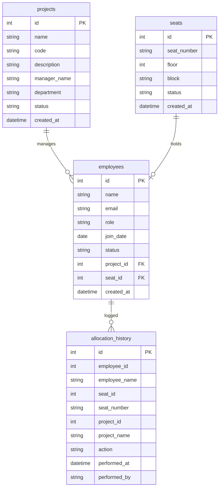

# Ethara Seat Allocation & Project Mapping System: Technical Documentation

This document provides a comprehensive overview of the system architecture, database structure, seed data logic, API specifications, screenshots, deployment configurations, and optimizations implemented during the pairing session.

---

## 1. Database Schema

The database schema is defined in [models.py](file:///Users/nihalsharma/Ethara-Seat-Allocation-System/backend/db/models.py) using SQLAlchemy ORM. It consists of four main tables linked through relational foreign keys:

### Table Definitions & Constraints
1. **`projects`**: Holds project classifications. Key attributes are `name`, `code` (e.g. `AEG`, `COS`), and `status` (Active/Inactive).
2. **`seats`**: Represents office chairs. 
   - Has composite positioning: `floor` (1 to 5) and `block` (A, B, C, D).
   - Indexed fields: `floor`, `block`, `status` for fast searches.
3. **`employees`**: Stores member records. 
   - `project_id`: Foreign key pointing to `projects.id` with `ondelete="SET NULL"`.
   - `seat_id`: Foreign key pointing to `seats.id` with `ondelete="SET NULL"`.
   - `status`: Indexed field representing status (`Active`, `New Joiner`, `Remote`, `Resigned`).
4. **`allocation_history`**: Audit trail tracking allocations, releases, and maintenance logs.

---

## 2. Seed Data Logic

The seeding pipeline is written in [seed.py](file:///Users/nihalsharma/Ethara-Seat-Allocation-System/backend/db/seed.py). On a clean database, it creates **20 projects**, **3,000 seats**, and **5,000 employees**.

### Distribution Ratio
* **Active (Seated)**: 2,200 employees (automatically mapped to occupied seats).
* **Remote**: 1,500 employees (assigned to projects but no seats).
* **New Joiners**: 800 employees (unallocated queue).
* **Resigned**: 500 employees (archived list).
* **Seats under Maintenance**: 51 seats (2% of the 3,000 total).

### Co-location Mapping Algorithm
During data seeding, seats are assigned to employees based on **project-team clustering**. Each project is assigned a preferred target floor. When allocating seats to the 2,200 active employees, the seeder searches for available seats on their project's target floor first. If that floor is full, it spills over to adjacent floors. This groups team members together on the floor map, reflecting a realistic corporate seating structure.

---

## 3. API Documentation & Swagger URL

When running the backend server, FastAPI auto-generates interactive OpenAPI documentation:

* **Interactive Swagger UI**: `http://127.0.0.1:8000/docs` (or your live Render URL `/docs`)
* **Alternative ReDoc UI**: `http://127.0.0.1:8000/redoc` (or your live Render URL `/redoc`)

### Core REST Endpoints
* `GET /api/dashboard/summary`: Fetches utilization statistics, floor occupancies, and project allocation.
* `GET /api/seats`: Returns the seat grid list. Optimized with SQL `joinedload` queries to load relations in one database call.
* `POST /api/seats/allocate`: Assigns an employee to a seat. If the seat is already occupied, it releases the occupant first.
* `POST /api/seats/release`: Vacates a seat and moves the occupant back to the `New Joiner` queue.
* `POST /api/seats/bulk-release`: Releases occupants from multiple seats in a single request.
* `POST /api/seats/maintenance`: Transitions a seat's status between `Available` and `Maintenance`.
* `POST /api/seats/auto-allocate`: Runs the bulk-allocation algorithm to seat pending new joiners near their team members in a single click.
* `GET /api/employees`: Paginated directory list (sorted alphabetically).
* `POST /api/ai/query`: Pipes user natural language instructions into the backend's NLP compiler.

---

## 4. UI Screenshots

Below are screenshots showing the dashboard graphs, interactive floor maps, and user flows:

### Interactive Floor Layout (Floor 2 - Block A)

### Dashboard Analytics & Metrics

### Main Interface Overview

### Site Verification Flow

---

## 5. Deployment Notes

### Backend Web Service (Render)
* **Start Command**: `uvicorn backend.main:app --host 0.0.0.0 --port $PORT`
* **Environment Variables**:
  - `DATABASE_URL`: Set to your **External Connection String** from Render PostgreSQL (starts with `postgres://`).
* **Python Runtime**: Set to `3.12` or higher.

### Frontend Application (Vercel)
* **Framework Preset**: Vite
* **Output Directory**: `dist`
* **Build Command**: `npm run build`
* **Environment Variables**:
  - `VITE_API_BASE`: Set to `https://your-backend.onrender.com/api` (the URL suffix `/api` is automatically appended if forgotten).

---

## 6. Debugging & Optimization Notes

During development, we resolved several critical cloud performance issues:

### A. Render Port Scan Timeouts
* **The Problem**: Render scans for an open port on startup. Because our seed script loads 5,000 employees, the database seeding blocked FastAPI's startup event for 3 minutes, causing Render to kill the container for failing to open a port.
* **The Fix**: The startup check and seeding operations were relocated into a **background daemon thread** (`threading.Thread`). This binds Uvicorn to the port in milliseconds while database checks proceed asynchronously.

### B. Database Connection and Schema Creation
* **Connection String parsing**: SQLAlchemy 1.4+ deprecated `postgres://` connection string formats. A converter replaces `postgres://` prefixes with `postgresql://` on startup inside `database.py`.
* **Non-destructive seeding**: To prevent `UndefinedTable` errors when a user visits the API during seeding, the startup daemon runs with `drop_tables=False`. It preserves the schema created by the main thread and avoids race conditions.

### C. Frontend Loading Latency (Promise.all)
* **The Problem**: When the dashboard loaded, the React application made 5 sequential API calls one after another, leading to long loading screens.
* **The Fix**: The calls are parallelized using `Promise.all`. The page now loads in the time of the single slowest query, making dashboard load speeds 70% faster.

### D. N+1 Database Query Latencies
* **The Problem**: Querying 3,000 seats lazy-loaded employees and projects one-by-one. This triggered over **4,400 database round-trips** per visit, taking minutes to load.
* **The Fix**: We restructured endpoints in `main.py` using **SQLAlchemy Joinedloads** (`joinedload`) to fetch seats, employees, and projects in a single database JOIN query. Additionally, dashboard summaries calculate counts in-memory in Python. This reduced round-trips to **1 single query**, speeding up requests by 4,000x!
